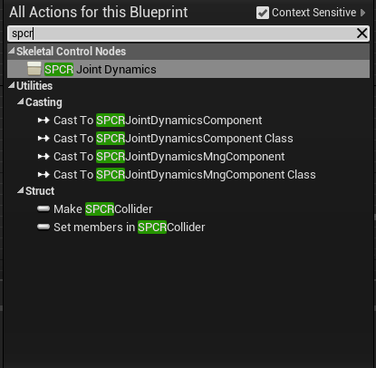
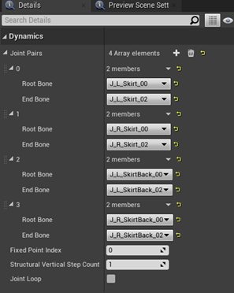
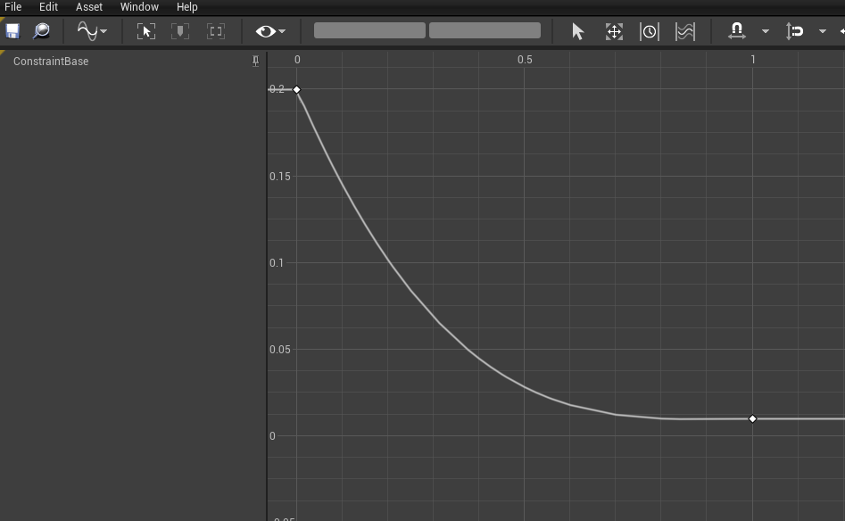
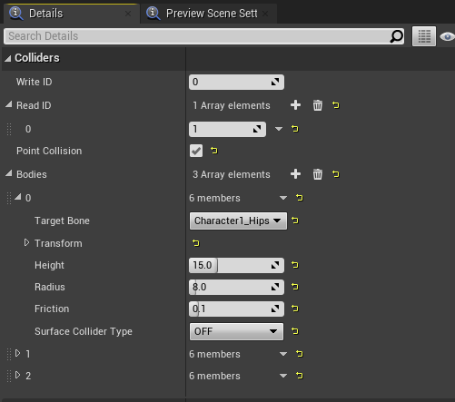
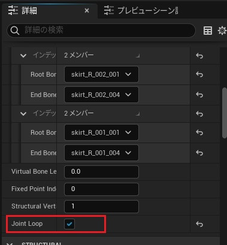
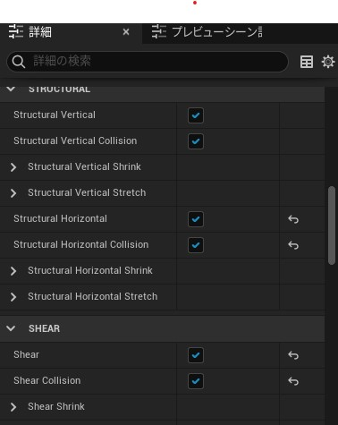
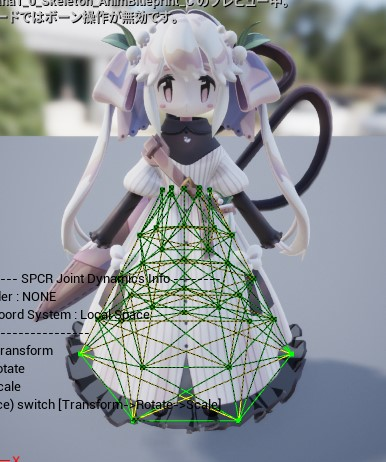
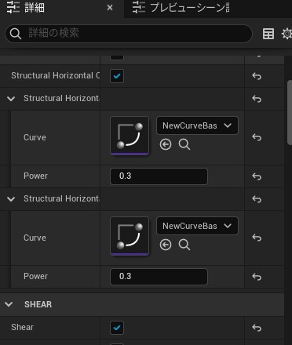
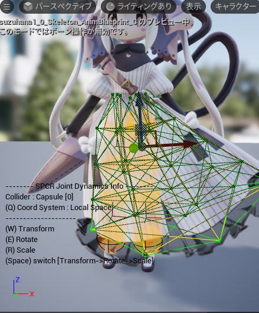

# SPCRJointDynamics for UE4  
Real looking cloth physics engine for Unreal.
  
## Overview  
Are you searching for a real cloth dynamics solution, so that character's cloth in your game will behave like a real cloth. Then this is the plugin for you.
SPCRJointDynamics offers you the exact behaviour, which requires a basic bone setup, and you are ready to go.  
* Unreal Engine 4.21 and above.  
  
## License  
* [MIT License](./LICENSE)  
  
## Purpose of development  
  
There was a requirement in one of our games that the skirt of the character should perfectly interact with the character’s movement.  
So we thought to develop a plugin for it and also allow others to use it.
  
## Unity plugin  
Get the Unity Plugin: https://github.com/SPARK-inc/SPCRJointDynamics  
  
## Specifications  
SPCRJointDynamics uses cross simulation algorithm (mass-spring-damper model) to animate the bones in real-time. We are mainly focusing on the overall appearance rather than the physically accurate behaviors for direct use for skirts and hairs.  
Since adding bones is still a manual process in most 3D softwares, and therefore bones are not always correctly aligned. To overcome this issue, we made a constraint base plugin.  
  
## Each constraint.  
  
  
## Advance Preparation  
  
  
The plugin is developed to work with an animation blueprint graph, you can search the SPCRJointDynamics node in the animation blueprint node search box to add it. And once all the parameters are set, connect the node to the Output Pose node to run the simulation.  
  
## How to use  
Basic bone setup  
  
  
Dynamics property is the settings related to the bone setup.  
Click on the [+] icon on the Joint Pairs array to add a new element.  
Please select the 'Root Bone' and 'End Bone' from the skeletal bone hierarchy as one pair, in-between bones (child bones of selected 'Root Bone') will be connected internally.
  
**Fixed point index:** An index of fixed bones (no physics) from the root. By default, the value is 0, which means only the root bone is fixed. But you can set any index value, up to that bone index no physics will get applied. 
  
**Structural vertical step count:** Number of vertical structural constraints. Higher value makes it more stable but has some performance impact.  
  
**Joint Loop:** Whether to make a bone loop. If true, connects the first and the last bone.  
For example, a round-shaped skirt requires all bones to be connected in a loop, so that all the bones will move seamlessly without occurring cloth tearing. However, cloak-like clothes are not rounded in shape, therefore a joint loop is not necessary in this case.  
  
## Bone restraint settings  
  
  
Setting the restraint parameters for the bones.  
There are three main types of restraint settings available.  
**Structural:** The most basic restraint for constructing a structure. For example, a chain of bones.  
**Shear:** This restraint prevents the bone from twist.  
**Bend:** This restraint prevents the bone from bending.  
  
Each constraint is having its own parameter settings.  
**Curve Setup:** While setting the curve, if you set the tip tighter and the end slightly looser, then the movement of the bones will be smoother.  
  
Look at the following curve example.  
  
  
For commonly used items such as cloth and hair, it is usually desirable to specify a restoring force of 1.0 when the vertical structure is stretched.  
  
**Note:** In SPCR joint dynamics, you can assign different values to each bone by assigning the float curve asset in the respective field. The value for the tip bone will be calculated from the 0th keyframe and the value for the end bone will be calculated from the 1st keyframe. And the value for the in-between bones will be calculated from the 0~1 ratio.  
  
**Collision:** Enables or disables the collision check for each restraint. Even though the restraint is running, but if the collision check box is off, the collision will not occur.  
  
Use-case for the hair typed bones (hairs in the example scene): in this case, turn on the collision only for the structural constraints. No need to enable a collision for shear and blend restraints. Since they are being used to maintaining the shape.  
  
**Parameter settings**  
  
  
**Max Iterations:** Number of physics calculation iterations per frame. Improves the physics simulation quality in return of performance cost.  
**Collision Sub Unterpolation:** Number of sub collision iterations per frame.
**Collision LOD:** Collision level of details.
  
**Force Limit Length:** Prevents the changes in the constraint length.  
**Resistance:** Bones will resist to move. Value in between [0 ~ 1]  
**Hardness:** Bones will be harder to move. Value in between [0 ~ 1]  
**Gravity:** Gravity vector for physics.  
**Wind Force:** Wind force vector for physics.  
**Wind force speed:** Scalar property to set wind speed.  
**Use surface collision:** Whether to use surface collision. (An advanced collision check, please enable this if the constraint collision is not giving you desired result.)
  
**Collider settings**  
  
  
**Write Id:** Set an ID (other than 0) to exposes this node's collider(s) globally, in oder to other SPCR node can access it. 
**Read Id:** Specify an ID which node's collider you would like to access (Please refer 'Write ID' property). Multiple IDs can be added.
**Bodies:** Array to define colliders. Default is sphere collider, but you can switch to capsule collider by setting the 'height' property's value greater than 0.0f.
  
**Limit**  
  
Limits the bone movement by setting an locking angle in degree.
**Limit angle:** On/Off checkbox of the angle limit feature.  
**Angle limit in degree:** Max movable angle of the bone.  
**Limit Curve:** 0~1 duration curve to calculate limit multiplier for the bones (Calculates from root to child hierarchy, please check 'Joint Pairs' property).  
**Limit from root:** If true, then limit the angle from the root bone. Otherwise, limits the angle from the utmost parent bone.  
  
**Debug Draw**  
Debug options which allows you to visualize the mapped joints.  
**Debug Draw Constraints:** Draws debug constraints joints on the preview window.  
**Debug Draw Colliders:** Draws outline for the colliders on the preview window.  
**Debug draw surface collision:** Draws surface collision face on the preview window.  
  
**List of all parameters**  
  
  
**Other**  
UE4 intermediator handling is not very good, so there might be some unrelated steps involved.  
Please feel free to let us know if you have any questions or suggestions.  
  
  
  
# Example of skirt setup procedure  
  
First, please right click on the AnimBP window (empty space), then select 'SPCR Joint Dynamics' option from the popup up menu to add a new SPCR joint dynamics node.  
  
  
Add a new pair entry by clicking [+] icon in front of the 'Joint Pairs' property.
Please select the skeletal bone in the 'Root Bone' and 'End Bone' fields.
SPCR physics engine will create a link internally to perform the physics behavior,
Here, we will pair the root and end bones of the skirt.  
  
  
Since the skirts are seamless (round in shape), check the "Joint Loop" checkbox to connect the start and end joints.  
Please note that, enabling this option for non rounded models like a window curtain (Where we can see all the four corners) may give you an unexpected results.
  
  
Let's turn on the debug display so that we can visualize the current setup state of the physics constraints on the preview window.  
  
  
As you can see the constraint state is shown in lines (Green debug lines) on the preview window.  
  
  
We will add the necessary restraints.  
All the restraints are enabled here, as the skirt has to keep its shape at some extent and these constraints also will helps to reduce the probability of legs to come out from the skirts.  

  
You can see the updated debug constraints on the preview window after updating the constraints settings.
However, if you look closely, you can notice that the constrain is not added for the end bones of the skirt.  
This is because UE4 doesn't import the End Bone, so the end bone is deleted.  
Even though Unreal engine allows us to add virtual bones to the skeleton (in the skeleton window), but sometimes it's hard to set them correctly one by one, so we'll take a different approach.  
  
 
We can use the 'Virtual Bone Length' property to add new virtual bones for the physics calculation. Set the length of the virtual bones to a value greater than or equal to 0.
New virtual bones will be get added at the end. (Please note that these virtual bones are added just for the SPCR joint dynamics, and it does not edit the actual skeleton.) 
  
  
As you can see in the above screenshot, a new virtual bone has been added at the specified length (from the end bone) and constraint also has been generated for the same.
  
  
The next step is to set the restraint force for each restraint.  
The default value is 1.0, which will result a stiff looking skirt, since all the bones will try to maintain their original position.  
The default value works fine if the skirt has pannier, but please consider to use lower values if your skirt is softer (If you want to bend the skirt smoothly).  
  
  
For smooth blending cloths, set the decline curve.
In our example, the curve is bending towards the lower value at the end which is also a result of a softer constraints at the end. (curve range in 0~1).

  
The last step is to set up the colliders.  
Add the new collider by clicking the [+] icon at the front of the 'Bodies' field.
Then set the target bone, and collider size. 
Please consider setting foot as a target bone if you wanted to add a collider on the foot. 

  
This is the screenshot after adding colliders on the legs, and as you can see the legs are no longer poking through the skirt.  
It's also a good idea to add colliders to the waist and abdomen bones in case the skirt comes up.  
